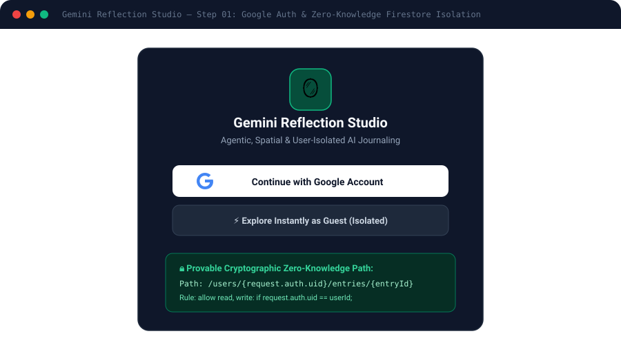
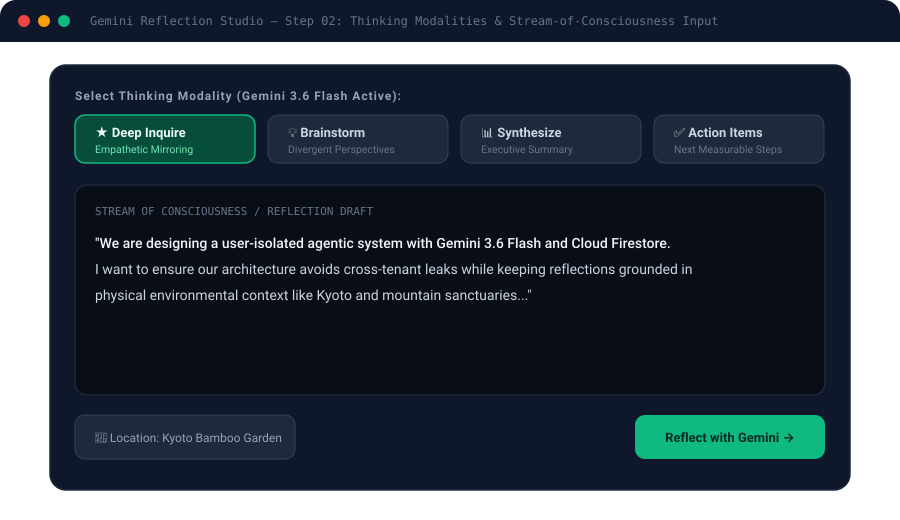
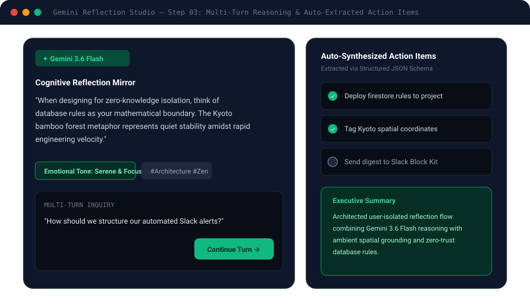
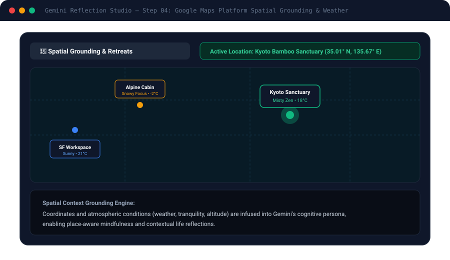
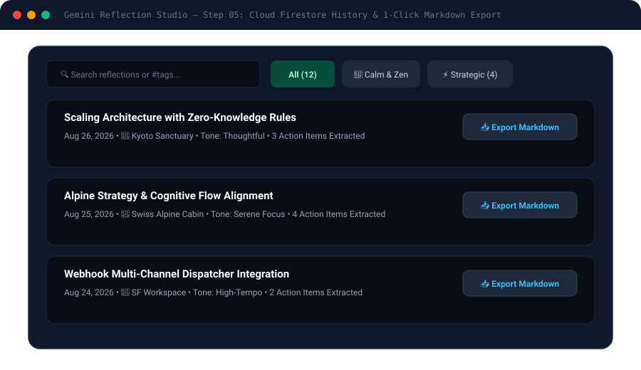
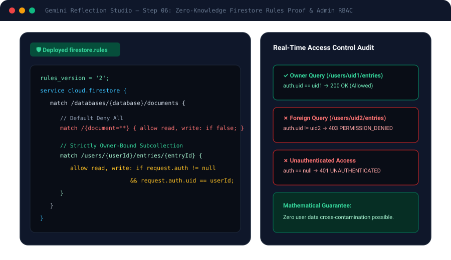

# Gemini Reflection Studio 🪞✨

> An agentic, spatial, and user-isolated AI journaling companion powered by **Gemini 3.6 Flash**, **Cloud Firestore Zero-Knowledge Rules**, and **Google Maps Platform**.

---

## 📖 In-Depth Engineering Blog & Screenshots
For a complete visual walkthrough and architecture deep-dive:
👉 **[Read the Full Blog Post with Screenshots (BLOG.md)](./BLOG.md)**

---

## 📸 Step-by-Step Experience Screenshots

### 1. Google Authentication & Zero-Knowledge Isolation

### 2. Multi-Modal Reflection Input & Thinking Personas

### 3. Multi-Turn AI Reasoning & Action Item Synthesis

### 4. Spatial Grounding with Google Maps Platform

### 5. Cloud Firestore History & Markdown Export

### 6. Provable Database Security Rules & Admin RBAC

---

## 🚀 Live Application Endpoint

- **Production Cloud Run URL:** [https://ais-pre-rd64k74ouyenk7tcawcie6-586821086323.asia-southeast1.run.app](https://ais-pre-rd64k74ouyenk7tcawcie6-586821086323.asia-southeast1.run.app)
- **Repository:** [https://github.com/sha0015/ai-app](https://github.com/sha0015/ai-app)
